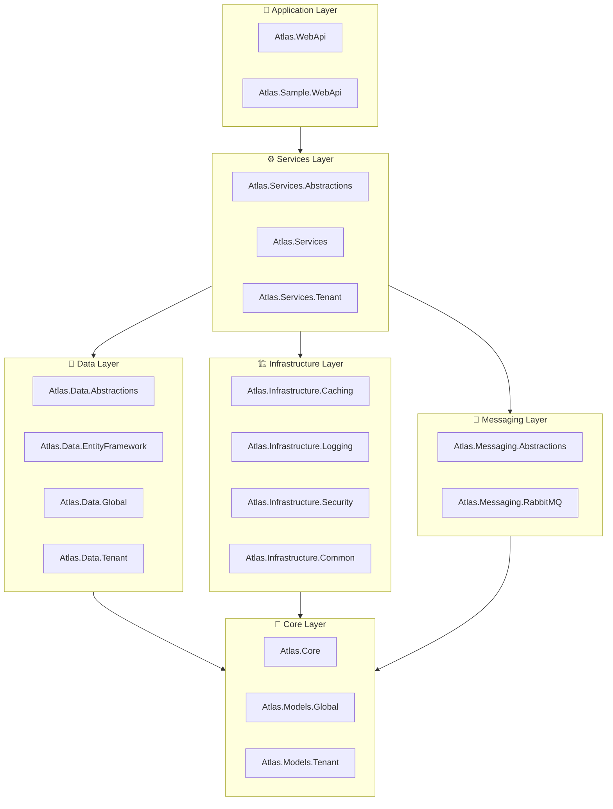

# Atlas 🌍

[](https://dotnet.microsoft.com/)
[](LICENSE)
[]()

**Atlas** 是一个基于 .NET 8.0 开发的企业级多租户底层框架，提供完整的多租户数据隔离、模块化架构设计和丰富的基础设施支持。

**Atlas** is an enterprise-grade multi-tenant framework built on .NET 8.0, providing complete multi-tenant data isolation, modular architecture design, and rich infrastructure support.

---

## ✨ 核心特性 | Core Features

- 🏢 **多租户架构** - Global/Tenant 数据库完全隔离，支持独立租户数据库
- 🧩 **模块化设计** - 清晰的分层架构，高度可扩展
- 🔐 **安全机制** - Token 认证、数据加密、敏感信息过滤
- 💾 **分布式缓存** - 支持 Redis 缓存，内存缓存降级
- 📨 **消息队列** - RabbitMQ + MassTransit + EF Outbox 可靠消息集成
- 📝 **结构化日志** - Serilog + Seq 日志聚合
- 🗄️ **数据访问** - Entity Framework Core + MySQL

---

## 🛠️ 技术栈 | Technology Stack

| 类别 | 技术 |
|------|------|
| **运行时** | .NET 8.0 |
| **ORM** | Entity Framework Core |
| **数据库** | MySQL |
| **缓存** | Redis |
| **日志** | Serilog + Seq |
| **API 文档** | Swagger/OpenAPI |
| **消息队列** | RabbitMQ + MassTransit |

---

## 🚀 快速开始 | Quick Start

### 环境要求 | Prerequisites

- [.NET 8.0 SDK](https://dotnet.microsoft.com/download/dotnet/8.0)
- [MySQL 8.0+](https://www.mysql.com/)
- [Redis 6.0+](https://redis.io/)
- [RabbitMQ 3.12+](https://www.rabbitmq.com/)
- [Visual Studio 2022](https://visualstudio.microsoft.com/) 或 [VS Code](https://code.visualstudio.com/)

### 安装步骤 | Installation

1. **克隆仓库 | Clone the repository**

```bash
git clone https://github.com/yangxing5200/Atlas.git
cd Atlas
```

2. **还原依赖 | Restore dependencies**

```bash
dotnet restore
```

3. **配置数据库连接 | Configure database connection**

编辑 `samples/Atlas.Sample.WebApi/appsettings.json`：

```json
{
  "ConnectionStrings": {
    "AtlasGlobal": "Server=localhost;Port=3306;Database=atlas_global;User=root;Password=your_password;CharSet=utf8mb4;"
  }
}
```

4. **运行数据库迁移 | Run database migrations**

```bash
# 全局数据库迁移
dotnet ef database update --project src/Atlas.Data.Global.Migrations --startup-project samples/Atlas.Sample.WebApi

# 租户数据库迁移
dotnet ef database update --project src/Atlas.Data.Tenant.Migrations --startup-project samples/Atlas.Sample.WebApi
```

5. **启动应用 | Run the application**

```bash
dotnet run --project samples/Atlas.Sample.WebApi
```

6. **访问 API 文档 | Access API documentation**

打开浏览器访问：`https://localhost:5001/swagger`

---

## 📐 项目架构 | Project Architecture

### 架构图 | Architecture Diagram



### 项目结构 | Project Structure

```
Atlas/
├── 📁 docs/                              # 文档
│   ├── architecture_guide.md             # 架构指南
│   └── store_hierarchy_design.md         # 存储层级设计
├── 📁 samples/                           # 示例项目
│   ├── Atlas.Sample.Console/             # 控制台示例
│   └── Atlas.Sample.WebApi/              # WebAPI 示例
├── 📁 src/
│   ├── 🎯 Atlas.Core/                    # 核心库（实体、接口、扩展方法）
│   ├── 📦 Atlas.Models.Global/           # 全局模型
│   ├── 📦 Atlas.Models.Tenant/           # 租户模型
│   ├── 💾 Atlas.Data.Abstractions/       # 数据访问抽象
│   ├── 💾 Atlas.Data.EntityFramework/    # EF Core 实现
│   ├── 💾 Atlas.Data.Global/             # 全局数据库上下文
│   ├── 💾 Atlas.Data.Global.Migrations/  # 全局数据库迁移
│   ├── 💾 Atlas.Data.Tenant/             # 租户数据库上下文
│   ├── 💾 Atlas.Data.Tenant.Migrations/  # 租户数据库迁移
│   ├── ⚙️ Atlas.Services.Abstractions/   # 服务抽象
│   ├── ⚙️ Atlas.Services/                # 服务实现
│   ├── ⚙️ Atlas.Services.Tenant/         # 租户服务
│   ├── 🏗️ Atlas.Infrastructure.Caching/  # 缓存基础设施
│   ├── 🏗️ Atlas.Infrastructure.Common/   # 通用基础设施
│   ├── 🏗️ Atlas.Infrastructure.Logging/  # 日志基础设施
│   ├── 🏗️ Atlas.Infrastructure.Security/ # 安全基础设施
│   ├── 📨 Atlas.Messaging.Abstractions/  # 消息抽象
│   ├── 📨 Atlas.Messaging.RabbitMQ/      # RabbitMQ 消息实现
│   ├── 🔌 Atlas.Extensions.DependencyInjection/ # DI 扩展
│   └── 📱 Atlas.WebApi/                  # WebAPI 项目
└── 📁 tests/                             # 测试项目
    ├── Atlas.Core.Tests/
    ├── Atlas.Data.Tests/
    ├── Atlas.Services.Tests/
    └── Atlas.Integration.Tests/
```

---

## 🔧 核心功能 | Core Features

### 1. 多租户支持 | Multi-Tenancy

Atlas 提供完整的多租户架构支持：

- **全局数据库 (GlobalDbContext)** - 存储租户配置、用户认证等跨租户数据
- **租户数据库 (TenantDbContext)** - 每个租户独立的业务数据隔离

```csharp
// 使用租户上下文
public class OrderService
{
    private readonly TenantDbContext _context;
    
    public async Task<Order> GetOrderAsync(int orderId)
    {
        // 自动按租户过滤数据
        return await _context.Orders.FindAsync(orderId);
    }
}
```

### 2. 认证授权 | Authentication & Authorization

- **Token 认证** - JWT Token 生成与验证
- **Cookie 认证** - 支持 Cookie 存储 Token
- **数据加密** - AES 加密服务

```csharp
// Token 认证配置
"Security": {
    "Token": {
        "SecretKey": "your-secret-key",
        "ExpirationMinutes": 1440,
        "CookieName": "atlas-auth-token"
    }
}
```

### 3. 缓存机制 | Caching

支持多种缓存策略：

- **Redis 缓存** - 分布式缓存
- **内存缓存** - 本地缓存
- **混合缓存** - L1 内存 + L2 Redis

```csharp
// 缓存配置
"CacheSettings": {
    "Provider": "Redis",
    "Redis": {
        "ConnectionString": "localhost:6379",
        "InstanceName": "atlas"
    }
}
```

### 4. 日志系统 | Logging

基于 Serilog 的结构化日志：

- **控制台输出** - 开发环境彩色日志
- **文件日志** - 按日期滚动存储
- **Seq 集成** - 日志聚合与搜索
- **敏感信息过滤** - 自动脱敏密码、Token 等

```csharp
// 日志配置
"Logging": {
    "Atlas": {
        "EnableConsole": true,
        "EnableFile": true,
        "EnableSeq": true,
        "SensitiveFields": ["password", "token", "apikey"]
    }
}
```

### 5. 消息队列 | Message Queue

基于 RabbitMQ + MassTransit 的可靠领域事件发布。业务代码依赖 `IDomainEventPublisher`，启用 RabbitMQ 后事件会先写入全局库 Outbox，再由 MassTransit 后台投递到 RabbitMQ：

```csharp
await _domainEventPublisher.PublishAsync(new TenantProvisionedEvent
{
    TenantId = tenant.Id,
    TenantName = tenant.Name,
    Domain = tenant.Domain,
    HeadquartersStoreId = headquarters.Id
});
```

---

## 📖 API 文档 | API Documentation

启动应用后，访问 Swagger UI 查看完整的 API 文档：

- **开发环境**: `https://localhost:5001/swagger`
- **生产环境**: `https://your-domain/swagger`

Swagger 提供：
- 📋 API 端点列表
- 📝 请求/响应模型
- 🧪 在线测试功能

---

## 🗄️ 数据库迁移 | Database Migrations

### 创建迁移 | Create Migration

```bash
# 全局数据库迁移
dotnet ef migrations add InitialCreate \
    --project src/Atlas.Data.Global.Migrations \
    --startup-project samples/Atlas.Sample.WebApi \
    --context GlobalDbContext

# 租户数据库迁移
dotnet ef migrations add InitialCreate \
    --project src/Atlas.Data.Tenant.Migrations \
    --startup-project samples/Atlas.Sample.WebApi \
    --context TenantDbContext
```

### 应用迁移 | Apply Migration

```bash
# 更新全局数据库
dotnet ef database update \
    --project src/Atlas.Data.Global.Migrations \
    --startup-project samples/Atlas.Sample.WebApi

# 更新租户数据库
dotnet ef database update \
    --project src/Atlas.Data.Tenant.Migrations \
    --startup-project samples/Atlas.Sample.WebApi
```

---

## ⚙️ 配置说明 | Configuration

### appsettings.json 配置项

| 配置项 | 说明 | 默认值 |
|--------|------|--------|
| `ConnectionStrings:AtlasGlobal` | 全局数据库连接字符串 | - |
| `Security:Token:SecretKey` | Token 签名密钥 | - |
| `Security:Token:ExpirationMinutes` | Token 过期时间（分钟） | 1440 |
| `Security:Crypto:Key` | AES 加密密钥（至少32字符） | - |
| `CacheSettings:Provider` | 缓存提供程序（Redis/Memory） | Redis |
| `CacheSettings:Redis:ConnectionString` | Redis 连接字符串 | localhost:6379 |
| `Messaging:Provider` | 消息提供程序（RabbitMQ/None） | None |
| `Messaging:RabbitMQ:Host` | RabbitMQ 主机 | localhost |
| `Messaging:RabbitMQ:Port` | RabbitMQ 端口 | 5672 |
| `Logging:Atlas:EnableConsole` | 启用控制台日志 | true |
| `Logging:Atlas:EnableFile` | 启用文件日志 | true |
| `Logging:Atlas:EnableSeq` | 启用 Seq 日志 | false |
| `Snowflake:WorkerId` | 雪花 ID 工作节点 | 1 |
| `Snowflake:DatacenterId` | 雪花 ID 数据中心 | 1 |

### 完整配置示例

```json
{
  "ConnectionStrings": {
    "AtlasGlobal": "Server=localhost;Port=3306;Database=atlas_global;User=root;Password=password;CharSet=utf8mb4;"
  },
  "Security": {
    "Crypto": {
      "Key": "your-32-character-encryption-key!!"
    },
    "Token": {
      "SecretKey": "your-secret-token-key",
      "ExpirationMinutes": 1440,
      "CookieName": "atlas-auth-token"
    }
  },
  "CacheSettings": {
    "Provider": "Redis",
    "Redis": {
      "ConnectionString": "localhost:6379",
      "InstanceName": "atlas"
    }
  },
  "Messaging": {
    "Provider": "RabbitMQ",
    "RabbitMQ": {
      "Host": "localhost",
      "Port": 5672,
      "VirtualHost": "/",
      "Username": "guest",
      "Password": "guest"
    }
  },
  "Snowflake": {
    "WorkerId": 1,
    "DatacenterId": 1
  }
}
```

---

## 🧪 运行测试 | Running Tests

```bash
# 运行所有测试
dotnet test

# 运行特定测试项目
dotnet test tests/Atlas.Core.Tests
dotnet test tests/Atlas.Services.Tests
dotnet test tests/Atlas.Data.Tests
dotnet test tests/Atlas.Integration.Tests
```

---

## 🤝 贡献指南 | Contributing

我们欢迎任何形式的贡献！

1. **Fork** 本仓库
2. 创建特性分支 (`git checkout -b feature/AmazingFeature`)
3. 提交更改 (`git commit -m 'Add some AmazingFeature'`)
4. 推送到分支 (`git push origin feature/AmazingFeature`)
5. 提交 **Pull Request**

### 代码规范

- 遵循 [C# 编码规范](https://docs.microsoft.com/en-us/dotnet/csharp/fundamentals/coding-style/coding-conventions)
- 使用有意义的变量和方法命名
- 添加适当的注释和文档
- 确保所有测试通过

---

## 📄 许可证 | License

本项目采用 MIT 许可证 - 查看 [LICENSE](LICENSE) 文件了解详情。

---

## 📞 联系我们 | Contact

如有问题或建议，请通过以下方式联系：

- 提交 [Issue](https://github.com/yangxing5200/Atlas/issues)
- 发起 [Discussion](https://github.com/yangxing5200/Atlas/discussions)

---

<p align="center">
  Made with ❤️ by the Atlas Team
</p>
