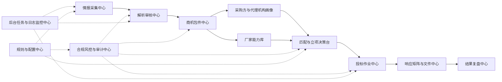

# BidOps Product Module Blueprint

> 更新日期：2026-06-12
> 适用范围：`src/Atlas.Modules.BidOps`、`frontend/atlas-admin`、Atlas Worker、Atlas tenant database
> 状态说明：本文是产品模块蓝图和后续实现边界，不代表所有模块都已经完成。当前代码优先；实现差异应记录到 `docs/BIDOPS_MODULE_GAPS.md`。

## 1. 产品定位

BidOps 的目标是成为 Atlas 内的招投标运营模块：

```text
公开情报发现
  -> 数据加工与人工治理
    -> 商机包件经营
      -> 资源匹配与立项决策
        -> 投标作业交付
          -> 响应核验与文件管理
            -> 结果复盘与经营分析
              -> 合规审计与运行可观测
```

BidOps 不是自动投标、自动报价、关系运作或非公开信息采集工具。所有采集、解析、匹配和决策能力必须基于公开信息、租户自有业务数据、明确授权的文件和人工审核结果。

最小业务单元是 `TenderPackage`，后续经营层的核心业务单元是 `Opportunity`。`Notice` 和 `TenderPackage` 是可信数据资产，`Opportunity`、`Pursuit`、`ResponseMatrixItem`、`BidOutcome` 承载后续经营动作。

## 2. Atlas 集成边界

| 领域 | 蓝图约束 |
|---|---|
| 模块位置 | BidOps 继续作为 Atlas 业务模块存在于 `src/Atlas.Modules.BidOps`。 |
| 数据库 | MVP 物理存储使用 Atlas Tenant DB，不创建独立 `BidOpsDbContext` 或独立迁移管线。 |
| 表命名 | BidOps 业务表统一使用 `bidops_` 前缀，租户业务唯一索引必须包含 `TenantId`。 |
| 数据访问 | BidOps API/业务服务使用 Atlas repository、QueryService、UnitOfWork 和数据范围约定，不直接注入 `AtlasTenantDbContext`。 |
| 长任务 | WebApi 只查询状态和入队；采集、附件处理、文档解析、AI/规则解析、补偿任务由 Worker 执行。 |
| 文件存储 | 附件二进制、HTML 快照、大段公告全文、提取文本通过 `IBidOpsFileStore` 保存，MySQL 只存元数据、哈希、摘要和状态。 |
| AI 结果 | AI/规则结构化结果先进入 staging 表，必须经人工审核后再写入正式业务表。 |
| 合规 | 不实现绕过登录、验证码、反爬、非公开数据、串标、围标、返点或隐蔽资金流相关能力。 |

## 3. 非破坏性演进规则

13 个模块扩展必须是增量演进，不做破坏性重构：

- 保留现有 Controller，包括 `CrawlSourcesController`、`CrawlChannelsController`、`RawNoticesController`、`ReviewTasksController`、`NoticesController`、`PackagesController`、`BidOpsOperationsController` 和 `BackgroundJobsOperationsController`。
- 保留现有 API 路由和请求/响应语义。新增模块路由可以作为别名或新版本入口，但不能删除或改名当前 `/api/bidops/*` 和 `/api/ops/background-jobs/*` 接口。
- 保留现有权限码：`bidops.crawl.read`、`bidops.crawl.manage`、`bidops.crawl.import`、`bidops.review.read`、`bidops.review.approve`、`bidops.business.read`。
- 新权限只能追加，不能替换旧权限导致当前账号、菜单或 API 失效。需要迁移到细粒度权限时，应先让新旧权限并行，再单独做兼容期清理决策。
- 保留现有实体和表名；新增经营层或后续 `Supplier`、`Pursuit` 等模型时，不改写 `Notice`、`TenderPackage`、`RequirementItem` 的既有职责。
- 前端旧路由继续可访问；新信息架构可以新增入口、redirect 或菜单分组，但不能让已可用页面变成 404 或调用不存在的后端接口。
- 文件、审核、采集和后台任务链路的现有行为不能因目录重组或命名调整被中断。

## 4. 主链路



## 5. 一级模块总览

| 序号 | 中文模块 | 建议英文上下文 | 当前状态 |
|---|---|---|---|
| 01 | 指挥中心 | `Dashboard` | 部分实现：业务 summary、待办、截止风险、商机漏斗已落地；胜率和投标作业风险待补。 |
| 02 | 情报采集中心 | `Intelligence` | 已有 MVP：来源、栏目、原始公告、附件、手动导入。 |
| 03 | 解析审核中心 | `Processing` | 已有 MVP：staging、待审核池、审核通过/忽略。 |
| 04 | 商机包件中心 | `Opportunities` | 部分实现：正式公告、包件、要求项、`Opportunity` 列表/详情/关注/评估/状态流转；截止日历和提醒待补。 |
| 05 | 采购方与代理机构画像 | `PublicOrgs` | 规划中。 |
| 06 | 厂家能力库 | `Suppliers` | 部分实现：厂家档案、联系人、能力标签、资质材料元数据、材料临期/过期扫描、厂家分析、公开结果公示厂家线索抽取和包件历史厂家线索已落地；完整 `SupplierPerformance`、胜率复盘和产品线增强待补。 |
| 07 | 匹配与立项决策台 | `Matching` | 部分实现：包件厂家匹配、缺失材料检测、匹配记录、Go/No-Go 决策已落地；规则版本和评分刷新待补。 |
| 08 | 投标作业中心 | `Pursuits` | 部分实现：作业、任务、跟进记录、状态流转和核心页面已落地；作业日历、提醒任务和风险模型待补。 |
| 09 | 响应矩阵与文件中心 | `Responses` | 规划中。 |
| 10 | 结果复盘中心 | `Outcomes` | 规划中；已作为厂家能力库前置能力实现公开结果厂家线索 `OutcomeSupplierRecord`，完整结果录入、复盘和胜率分析待补。 |
| 11 | 合规风控与审计中心 | `Compliance` | 部分约束已落地；业务合规模型待补。 |
| 12 | 后台任务与日志监控中心 | `Operations` | 已有 P0：任务列表、详情、重试、取消、配置检查、栏目健康、Worker 心跳。 |
| 13 | 规则与配置中心 | `Settings` | 规划中。 |

## 6. 13 个模块实施契约

本节用固定字段描述每个模块，后续补代码时按这些字段拆实体、Controller、QueryService、后台任务、权限和前端路由。`当前` 表示代码已存在；`规划` 表示蓝图目标，未实现前只能文档化或禁用占位。

### 6.1 指挥中心

**目标**：让业务负责人一眼看到今日新增机会、待审核公告、高价值包件、截止风险、投标作业风险、后台任务异常和复盘指标。

**路由**：

```text
当前：
/bidops
/bidops/dashboard
```

**API**：

```http
当前可复用：
GET /api/bidops/operations/dashboard
GET /api/bidops/dashboard/summary

规划：
GET /api/bidops/dashboard/todos
GET /api/bidops/dashboard/deadlines
GET /api/bidops/dashboard/risks
GET /api/bidops/dashboard/pipeline
```

**权限**：

```text
当前：
bidops.dashboard.read

说明：`/api/bidops/dashboard/summary` 当前仍用 `bidops.business.read` 做运行时兼容，`bidops.dashboard.read` 已进入授权目录和本地种子。
```

**后台任务**：

```text
当前：无直接写入业务数据的 dashboard task；复用 OpportunityMaintenance 和运维任务数据。
依赖数据：采集任务、解析任务、审核任务、商机提醒任务、投标作业提醒任务、运维任务状态
```

**核心对象**：

```text
当前：BidOpsOperationsDashboardDto、BidOpsDashboardSummaryDto、BidOpsDashboardTodoDto、BidOpsDashboardDeadlineRiskDto、BidOpsMetricBucketDto
规划：BidOpsRiskSignal、PipelineMetric、胜率/投标作业风险指标
```

### 6.2 情报采集中心

**目标**：管理公开采集来源、栏目、手动导入、原始公告、附件发现、附件下载、文本提取、原文快照和采集质量。

**路由**：

```text
当前：
/bidops/crawl/sources
/bidops/crawl/channels
/bidops/crawl/raw-notices
/bidops/crawl/raw-notices/:id
/bidops/intelligence/run-logs
/bidops/intelligence/run-logs/:id

规划：
/bidops/intelligence/sources
/bidops/intelligence/channels
/bidops/intelligence/raw-notices
/bidops/intelligence/raw-notices/:id
/bidops/intelligence/manual-import
```

**API**：

```http
当前：
GET  /api/bidops/crawl-sources
POST /api/bidops/crawl-sources
PUT  /api/bidops/crawl-sources/{id}
POST /api/bidops/crawl-sources/{id}/enable
POST /api/bidops/crawl-sources/{id}/disable

GET  /api/bidops/crawl-channels
POST /api/bidops/crawl-channels
PUT  /api/bidops/crawl-channels/{id}
POST /api/bidops/crawl-channels/{id}/scan-now

GET  /api/bidops/raw-notices
GET  /api/bidops/raw-notices/{id}
GET  /api/bidops/raw-notices/{id}/pipeline
GET  /api/bidops/raw-notices/{id}/attachments
GET  /api/bidops/raw-notices/{id}/attachments/{attachmentId}/text
GET  /api/bidops/raw-notices/{id}/attachments/{attachmentId}/file
POST /api/bidops/raw-notices/{id}/reparse
POST /api/bidops/raw-notices/import-url
GET  /api/bidops/crawl-run-logs
GET  /api/bidops/crawl-run-logs/{id}

规划：
GET  /api/bidops/raw-notices/{id}/versions
POST /api/bidops/raw-notices/{id}/refetch
```

**权限**：

```text
当前：
bidops.crawl.read
bidops.crawl.manage
bidops.crawl.import

规划：
bidops.intelligence.read
bidops.intelligence.manage
bidops.intelligence.import
bidops.intelligence.refetch
```

**后台任务**：

```text
当前：
bidops.raw.manual-url-import
bidops.crawl.mock-scan
bidops.crawl.state-grid-ecp-scan
bidops.document.attachment-process
bidops.scheduled-scan
bidops.recovery

规划：
bidops.crawl.detail-fetch
bidops.document.attachment-discover
bidops.document.attachment-download
bidops.document.text-extract
bidops.governance.version-detect
bidops.governance.data-quality-audit
```

**核心对象**：

```text
当前：CrawlSource、CrawlChannel、CrawlRunLog、RawNotice、RawAttachment、RawNoticePipelineDto
规划：RawNoticeVersion、CrawlQualityIssue
```

### 6.3 解析审核中心

**目标**：把原始公告和附件文本转换为可审核的结构化 staging 数据，并由人工审核后写入正式业务表。

**路由**：

```text
当前：
/bidops/review/tasks
/bidops/review/tasks/:id
/bidops/processing/failed

规划：
/bidops/processing/review-tasks
/bidops/processing/review-tasks/:id
/bidops/processing/duplicates
/bidops/processing/versions
```

**API**：

```http
当前：
GET  /api/bidops/review-tasks
GET  /api/bidops/review-tasks/{id}
POST /api/bidops/review-tasks/{id}/approve
POST /api/bidops/review-tasks/{id}/ignore
GET  /api/bidops/processing/failures
POST /api/bidops/raw-notices/{id}/reparse

规划：
GET  /api/bidops/processing/duplicates
POST /api/bidops/review-tasks/{id}/merge
GET  /api/bidops/review-tasks/{id}/diff
PUT  /api/bidops/review-tasks/{id}/staging
```

**权限**：

```text
当前：
bidops.review.read
bidops.review.approve

说明：P0 重解析入口暂复用 `bidops.review.approve`，未来可兼容迁移到更细的 `bidops.processing.reparse`。

规划：
bidops.processing.read
bidops.processing.reparse
bidops.processing.manage
bidops.review.merge
```

**后台任务**：

```text
当前：
bidops.ai.structured-parse
bidops.ai.mock-parse
bidops.document.attachment-process（重解析入口先重跑附件处理，再强制新建结构化解析任务）
bidops.recovery

规划：
bidops.governance.deduplicate
bidops.governance.generate-review-task
bidops.governance.data-quality-audit
```

**核心对象**：

```text
当前：NoticeStaging、PackageStaging、RequirementStaging、ReviewTask
规划：ReviewDiff、DuplicateCandidate、ParseFailure、StagingEditSnapshot
```

### 6.4 商机包件中心

**目标**：把审核后的正式公告、包件和要求项提升为可经营商机，支持关注、评估、截止提醒和后续立项。

**路由**：

```text
当前：
/bidops/notices
/bidops/packages
/bidops/packages/:id
/bidops/opportunities
/bidops/opportunities/:id
/bidops/opportunities/watchlist

规划：
/bidops/opportunities/calendar
/bidops/opportunities/assessments
```

**API**：

```http
当前：
GET  /api/bidops/notices
GET  /api/bidops/packages
GET  /api/bidops/packages/{id}
GET  /api/bidops/packages/{id}/timeline
GET  /api/bidops/packages/{id}/requirements
GET  /api/bidops/opportunities
POST /api/bidops/opportunities
GET  /api/bidops/opportunities/{id}
PUT  /api/bidops/opportunities/{id}
POST /api/bidops/opportunities/{id}/watch
POST /api/bidops/opportunities/{id}/assess
POST /api/bidops/opportunities/{id}/stage

规划：
GET  /api/bidops/opportunities/calendar
```

**权限**：

```text
当前：
bidops.business.read
bidops.opportunity.read
bidops.opportunity.manage
bidops.opportunity.watch
bidops.opportunity.assess

说明：商机列表和详情 API 当前继续兼容 `bidops.business.read`，写操作使用 `opportunity.*` 权限。
```

**后台任务**：

```text
当前：
bidops.opportunity.value-assessment
bidops.opportunity.deadline-reminder
bidops.opportunity.watch-reminder
bidops.opportunity.stale-state-scan

说明：当前为周期入队和可审计扫描结果；外部通知渠道、站内通知实体和提醒确认记录仍待后续实现。
```

**核心对象**：

```text
当前：Notice、TenderPackage、RequirementItem、Opportunity、OpportunityStageHistory、OpportunityWatch
规划：OpportunityAssessment
```

### 6.5 采购方与代理机构画像

**目标**：基于公开公告、公开附件和公开结果沉淀采购方、代理机构、地区、品类和历史行为统计，服务商机判断。

**路由**：

```text
规划：
/bidops/public-orgs/buyers
/bidops/public-orgs/buyers/:id
/bidops/public-orgs/agencies
/bidops/public-orgs/agencies/:id
/bidops/public-orgs/stats
/bidops/public-orgs/aliases
```

**API**：

```http
规划：
GET  /api/bidops/public-orgs/buyers
GET  /api/bidops/public-orgs/buyers/{id}
GET  /api/bidops/public-orgs/agencies
GET  /api/bidops/public-orgs/agencies/{id}
GET  /api/bidops/public-orgs/stats
POST /api/bidops/public-orgs/aliases
PUT  /api/bidops/public-orgs/aliases/{id}
```

**权限**：

```text
规划：
bidops.public-org.read
bidops.public-org.manage-alias
```

**后台任务**：

```text
规划：
bidops.public-org.profile-refresh
bidops.public-org.stats-refresh
bidops.public-org.alias-suggestion
```

**核心对象**：

```text
规划：BuyerProfile、AgencyProfile、PublicOrganizationAlias、BuyerProcurementStat、AgencyNoticePattern
```

### 6.6 厂家能力库

**目标**：管理厂家、联系人、产品线、能力标签、资质材料和有效期，为包件匹配和投标文件准备提供依据。

**路由**：

```text
当前：
/bidops/suppliers
/bidops/suppliers/:id
/bidops/suppliers/analysis

规划：
/bidops/suppliers/evidence-expiry
/bidops/suppliers/performance
```

**API**：

```http
当前：
GET  /api/bidops/suppliers
POST /api/bidops/suppliers
GET  /api/bidops/suppliers/{id}
PUT  /api/bidops/suppliers/{id}
POST /api/bidops/suppliers/{id}/contacts
POST /api/bidops/suppliers/{id}/capabilities
POST /api/bidops/suppliers/{id}/evidence-documents
GET  /api/bidops/suppliers/analysis/summary
GET  /api/bidops/suppliers/outcome-records
GET  /api/bidops/suppliers/outcome-summary
POST /api/bidops/suppliers/outcome-records/backfill
GET  /api/bidops/packages/{id}/historical-suppliers

说明：`GET /api/bidops/suppliers/{id}` 当前返回厂家基础信息、联系人、能力标签和资质材料集合；`analysis/summary` 读取真实厂家、能力、材料、匹配、立项、作业和公开结果厂家线索数据。公开中标/成交/候选公示抽取结果进入 `OutcomeSupplierRecord`，保留来源公告、证据文本、包件快照和可选 Supplier 弱关联；不会自动创建厂家主档，也不会生成自动联系动作。暂未拆出独立子资源 GET 接口，完整 `SupplierPerformance` 和胜率复盘仍属结果复盘阶段。

规划：
GET  /api/bidops/suppliers/{id}/contacts
GET  /api/bidops/suppliers/{id}/capabilities
GET  /api/bidops/suppliers/{id}/evidence-documents
GET  /api/bidops/suppliers/evidence-expiry
```

**权限**：

```text
当前：
bidops.supplier.read
bidops.supplier.manage
bidops.supplier.evidence.read
bidops.supplier.evidence.manage
```

**后台任务**：

```text
当前：
bidops.supplier.evidence-expiry-scan
bidops.outcome.supplier-extract

规划：
bidops.supplier.profile-quality-audit
bidops.analytics.supplier-performance-refresh
```

**核心对象**：

```text
当前：Supplier、SupplierContact、SupplierCapability、SupplierEvidenceDocument、OutcomeSupplierRecord、SupplierAnalysisSummary(read model)
规划：SupplierProductLine、SupplierPerformance
```

### 6.7 匹配与立项决策台

**目标**：对包件要求和厂家能力进行规则化匹配，输出缺失材料、风险、评分和 Go/No-Go 决策记录。

**路由**：

```text
当前：
/bidops/matching/packages
/bidops/matching/runs
/bidops/matching/runs/:id
/bidops/matching/decisions

规划：
/bidops/matching/rules-preview
```

**API**：

```http
当前：
POST /api/bidops/packages/{id}/match-suppliers
GET  /api/bidops/matching/runs
GET  /api/bidops/matching/runs/{id}
GET  /api/bidops/matching/runs/{id}/results
POST /api/bidops/packages/{id}/decisions
GET  /api/bidops/packages/{id}/decisions

规划：
GET  /api/bidops/matching/rule-sets
POST /api/bidops/matching/rule-sets
POST /api/bidops/matching/runs/{id}/refresh-score
```

**权限**：

```text
当前：
bidops.matching.read
bidops.matching.run
bidops.matching.decide
```

**后台任务**：

```text
当前：
bidops.matching.supplier-match-run

规划：
bidops.matching.missing-evidence-check
bidops.matching.score-refresh
```

**核心对象**：

```text
当前：SupplierMatchRun、SupplierMatchResult、MissingEvidenceCheck、GoNoGoDecision
规划：MatchingRuleSet、匹配规则版本、评分刷新记录
```

### 6.8 投标作业中心

**目标**：将已立项商机转成可推进的投标作业，管理负责人、任务、跟进记录、截止日和作业状态。

**路由**：

```text
当前：
/bidops/pursuits
/bidops/pursuits/:id
/bidops/pursuits/my-tasks

规划：
/bidops/pursuits/calendar
```

**API**：

```http
当前：
GET  /api/bidops/pursuits
POST /api/bidops/pursuits
GET  /api/bidops/pursuits/{id}
PUT  /api/bidops/pursuits/{id}
GET  /api/bidops/pursuits/{id}/tasks
POST /api/bidops/pursuits/{id}/tasks
PUT  /api/bidops/pursuits/{id}/tasks/{taskId}
GET  /api/bidops/pursuits/{id}/follow-records
POST /api/bidops/pursuits/{id}/follow-records
POST /api/bidops/pursuits/{id}/status

规划：
GET  /api/bidops/pursuits/calendar
```

**权限**：

```text
当前：
bidops.pursuit.read
bidops.pursuit.manage
bidops.pursuit.task.manage
bidops.pursuit.follow-record.manage
```

**后台任务**：

```text
规划：
bidops.pursuit.deadline-reminder-scan
bidops.pursuit.overdue-task-scan
bidops.pursuit.status-sync
```

**核心对象**：

```text
当前：Pursuit、PursuitTask、PursuitFollowRecord
规划：PursuitRisk
```

### 6.9 响应矩阵与文件中心

**目标**：将招标要求拆成响应矩阵，绑定证据文件、模板、版本和提交前检查结果，减少漏项。

**路由**：

```text
规划：
/bidops/responses/matrix
/bidops/responses/files
/bidops/responses/submission-checks
/bidops/responses/templates
```

**API**：

```http
规划：
GET  /api/bidops/pursuits/{id}/response-matrix
POST /api/bidops/pursuits/{id}/response-matrix
PUT  /api/bidops/pursuits/{id}/response-matrix/{itemId}
POST /api/bidops/pursuits/{id}/submission-checks
GET  /api/bidops/pursuits/{id}/submission-checks
GET  /api/bidops/files
POST /api/bidops/files
GET  /api/bidops/files/{id}/versions
POST /api/bidops/files/{id}/versions
GET  /api/bidops/document-templates
POST /api/bidops/document-templates
```

**权限**：

```text
规划：
bidops.response.read
bidops.response.manage
bidops.response.check
bidops.file.read
bidops.file.manage
```

**后台任务**：

```text
规划：
bidops.response.generate-matrix
bidops.response.submission-check
bidops.response.file-version-snapshot
```

**核心对象**：

```text
规划：ResponseMatrixItem、ResponseEvidenceBinding、SubmissionCheckRun、BidDocument、BidDocumentVersion、DocumentTemplate
```

### 6.10 结果复盘中心

**目标**：记录中标、失标、废标、候选结果和复盘结论，形成地区、品类、厂家、采购方维度的经营分析。

**路由**：

```text
规划：
/bidops/outcomes
/bidops/outcomes/:id
/bidops/outcomes/reviews
/bidops/outcomes/analytics
```

**API**：

```http
当前：
GET  /api/bidops/suppliers/outcome-records
GET  /api/bidops/suppliers/outcome-summary
POST /api/bidops/suppliers/outcome-records/backfill
GET  /api/bidops/packages/{id}/historical-suppliers

规划：
GET  /api/bidops/outcomes
POST /api/bidops/outcomes
GET  /api/bidops/outcomes/{id}
PUT  /api/bidops/outcomes/{id}
GET  /api/bidops/outcomes/{id}/review
POST /api/bidops/outcomes/{id}/review
GET  /api/bidops/analytics/win-rate
GET  /api/bidops/analytics/supplier-performance
GET  /api/bidops/analytics/category-win-rate
GET  /api/bidops/analytics/region-win-rate
```

**权限**：

```text
规划：
bidops.outcome.read
bidops.outcome.manage
bidops.analytics.read
```

**后台任务**：

```text
当前：
bidops.outcome.supplier-extract

规划：
bidops.outcome.public-award-result-scan
bidops.analytics.win-rate-refresh
bidops.analytics.supplier-performance-refresh
```

**核心对象**：

```text
当前：OutcomeSupplierRecord
规划：BidOutcome、OutcomeReview、CategoryWinRateStat、RegionWinRateStat、SupplierPerformance
```

### 6.11 合规风控与审计中心

**目标**：对采集、审核、商机判断、厂家匹配、投标作业和文件响应进行合规提示、风险阻断和审计追踪。

**路由**：

```text
规划：
/bidops/compliance/checks
/bidops/compliance/sensitive-words
/bidops/compliance/audit
/bidops/compliance/rules
```

**API**：

```http
规划：
GET  /api/bidops/compliance/checks
POST /api/bidops/compliance/checks/run
GET  /api/bidops/compliance/checks/{id}
GET  /api/bidops/compliance/sensitive-words
POST /api/bidops/compliance/sensitive-words
PUT  /api/bidops/compliance/sensitive-words/{id}
GET  /api/bidops/compliance/rules
POST /api/bidops/compliance/rules
PUT  /api/bidops/compliance/rules/{id}
GET  /api/bidops/audit-logs
```

**权限**：

```text
规划：
bidops.compliance.read
bidops.compliance.manage
bidops.audit.read
```

**后台任务**：

```text
规划：
bidops.compliance.pursuit-conflict-scan
bidops.compliance.sensitive-word-audit
bidops.compliance.audit-log-retention
```

**核心对象**：

```text
规划：ComplianceCheck、SensitiveWordHit、ComplianceRule、BidOpsAuditLog
```

### 6.12 后台任务与日志监控中心

**目标**：让管理员看到 BidOps 任务队列、失败原因、Payload 摘要、重试/取消入口、栏目健康、Worker 状态和关键配置风险。

**路由**：

```text
当前：
/bidops/operations
/bidops/operations/jobs
/bidops/operations/channels
/bidops/operations/worker-heartbeats
/ops/jobs
/ops/jobs/:id
/ops/workers

规划：
/bidops/operations/logs
/bidops/operations/pipelines
```

**API**：

```http
当前：
GET  /api/ops/background-jobs
GET  /api/ops/background-jobs/summary
GET  /api/ops/background-jobs/{id}
POST /api/ops/background-jobs/{id}/retry
POST /api/ops/background-jobs/{id}/cancel
GET  /api/ops/workers
GET  /api/bidops/operations/dashboard
GET  /api/bidops/operations/jobs
GET  /api/bidops/operations/config-check
GET  /api/bidops/operations/channels/health
GET  /api/bidops/operations/raw-notices/{id}/pipeline
POST /api/bidops/operations/jobs/{id}/retry
POST /api/bidops/operations/jobs/{id}/cancel

规划：
GET  /api/bidops/operations/logs
GET  /api/bidops/operations/alerts
POST /api/bidops/operations/alerts/{id}/ack
```

**权限**：

```text
当前：
bidops.crawl.read
bidops.crawl.manage
bidops.ops.read
bidops.ops.manage

规划：
暂无；后续如拆分日志、告警、Worker 心跳管理，再追加更细权限。
```

**后台任务**：

```text
当前观察对象：所有 bidops queue BackgroundJobs、BackgroundWorkerHeartbeat

规划：
bidops.notification.failed-job-reminder
bidops.operations.pipeline-snapshot
bidops.compliance.audit-log-retention
```

**核心对象**：

```text
当前：BackgroundJob、BackgroundWorkerHeartbeat、BackgroundJobOperationsDto、BackgroundWorkerHeartbeatDto、BidOpsOperationsDashboardDto、BidOpsChannelHealthDto、RawNoticePipelineDto、masked payload view
规划：LogQueryResult、RawNoticePipelineView、OperationsAlert
```

### 6.13 规则与配置中心

**目标**：管理字典、匹配规则、合规规则、AI Prompt、通知规则和运行开关，让运营规则可审计、可回滚。

**路由**：

```text
规划：
/bidops/settings/dictionaries
/bidops/settings/matching-rules
/bidops/settings/compliance-rules
/bidops/settings/ai-prompts
/bidops/settings/notifications
/bidops/settings/feature-switches
```

**API**：

```http
规划：
GET  /api/bidops/settings/dictionaries
POST /api/bidops/settings/dictionaries
PUT  /api/bidops/settings/dictionaries/{id}
GET  /api/bidops/settings/matching-rules
POST /api/bidops/settings/matching-rules
PUT  /api/bidops/settings/matching-rules/{id}
GET  /api/bidops/settings/compliance-rules
POST /api/bidops/settings/compliance-rules
PUT  /api/bidops/settings/compliance-rules/{id}
GET  /api/bidops/settings/ai-prompts
POST /api/bidops/settings/ai-prompts
PUT  /api/bidops/settings/ai-prompts/{id}
GET  /api/bidops/settings/notification-rules
POST /api/bidops/settings/notification-rules
PUT  /api/bidops/settings/notification-rules/{id}
GET  /api/bidops/settings/feature-switches
PUT  /api/bidops/settings/feature-switches/{key}
```

**权限**：

```text
规划：
bidops.config.read
bidops.config.manage
bidops.rules.read
bidops.rules.manage
```

**后台任务**：

```text
规划：
bidops.rules.activation-audit
bidops.ai.prompt-validation
bidops.notification.rule-dry-run
```

**核心对象**：

```text
规划：BidOpsDictionaryItem、MatchingRuleSet、ComplianceRule、AiPromptTemplate、NotificationRule、BidOpsFeatureSwitch
```

## 7. 现有能力映射

| 现有能力 | 新模块归属 | 处理方式 |
|---|---|---|
| `CrawlSource` / `CrawlChannel` | 情报采集中心 | 保留现有 API 和路由；可逐步增加 `intelligence` 别名或菜单分组。 |
| `RawNotice` / `RawAttachment` | 情报采集中心 | 保留；继续增强附件、流水线、版本和质量信息。 |
| `NoticeStaging` / `PackageStaging` / `RequirementStaging` | 解析审核中心 | 保留；后续补可编辑审核、置信度、重析、差异视图。 |
| `ReviewTask` | 解析审核中心 | 保留；审核体验以中文可读文本和附件文本为主。 |
| `Notice` / `TenderPackage` / `RequirementItem` | 商机包件中心 | 保留；`Opportunity` 经营层已追加，不替代现有正式数据。 |
| `BackgroundJob` / Worker / operations pages | 后台任务与日志监控中心 | 保留 P0；后续补日志查询、告警和长期趋势。 |
| `bidops.crawl.*` / `bidops.review.*` / `bidops.business.read` | 旧权限组 | 保留兼容；新增细粒度权限时不得删除旧权限。 |
| Supplier | 厂家能力库 | 厂家档案、联系人、能力标签、资质材料、材料有效期扫描、厂家分析和公开结果厂家线索已追加；完整 SupplierPerformance、胜率复盘和产品线增强继续规划。 |
| Matching | 匹配与立项决策台 | 已追加匹配运行、匹配结果、缺失材料检查、Go/No-Go 决策和 Worker 匹配任务；规则配置和评分刷新继续规划。 |
| Pursuit | 投标作业中心 | 已追加作业、任务、跟进记录、状态流转、核心页面和包件详情创建作业入口；作业日历、提醒任务和风险模型继续规划。 |
| Response / Outcome | 愿景能力 | 未实现前只能做规划或禁用占位，不返回伪造业务数据。 |

## 8. 数据模型优先级

### 8.1 已有模型继续稳定

```text
CrawlSource
CrawlChannel
CrawlRunLog
RawNotice
RawAttachment
NoticeStaging
PackageStaging
RequirementStaging
ReviewTask
Notice
TenderPackage
RequirementItem
Opportunity
OpportunityStageHistory
OpportunityWatch
Supplier
SupplierContact
SupplierCapability
SupplierEvidenceDocument
SupplierMatchRun
SupplierMatchResult
MissingEvidenceCheck
GoNoGoDecision
Pursuit
PursuitTask
PursuitFollowRecord
```

### 8.2 下一批必须补的模型

```text
ResponseMatrixItem
ResponseEvidenceBinding
SubmissionCheckRun
BidOutcome
ComplianceCheck
SensitiveWordHit
BidOpsNotification
```

### 8.3 再下一批增强模型

```text
BuyerProfile
AgencyProfile
PublicOrganizationAlias
BuyerProcurementStat
AgencyNoticePattern
SupplierProductLine
SupplierPerformance
PursuitRisk
BidDocument
BidDocumentVersion
DocumentTemplate
OutcomeReview
CategoryWinRateStat
RegionWinRateStat
MatchingRuleSet
AiPromptTemplate
```

## 9. 权限体系

旧权限必须保留：

```text
bidops.crawl.read
bidops.crawl.manage
bidops.crawl.import
bidops.review.read
bidops.review.approve
bidops.business.read
```

P0 已追加运维权限：

```text
bidops.ops.read
bidops.ops.manage
```

Phase B 已追加 dashboard 和商机权限：

```text
bidops.dashboard.read
bidops.opportunity.read
bidops.opportunity.manage
bidops.opportunity.watch
bidops.opportunity.assess
```

Phase C 已追加厂家权限：

```text
bidops.supplier.read
bidops.supplier.manage
bidops.supplier.evidence.read
bidops.supplier.evidence.manage
```

Phase D 已追加匹配权限：

```text
bidops.matching.read
bidops.matching.run
bidops.matching.decide
```

Phase E 已追加投标作业权限：

```text
bidops.pursuit.read
bidops.pursuit.manage
bidops.pursuit.task.manage
bidops.pursuit.follow-record.manage
```

新权限建议按模块逐步追加：

```text
bidops.intelligence.read
bidops.intelligence.manage
bidops.intelligence.import
bidops.intelligence.refetch
bidops.processing.read
bidops.processing.reparse
bidops.processing.manage
bidops.review.merge
bidops.public-org.read
bidops.public-org.manage-alias
bidops.response.read
bidops.response.manage
bidops.response.check
bidops.file.read
bidops.file.manage
bidops.outcome.read
bidops.outcome.manage
bidops.analytics.read
bidops.compliance.read
bidops.compliance.manage
bidops.audit.read
bidops.config.read
bidops.config.manage
bidops.rules.read
bidops.rules.manage
```

执行规则：

- 前端菜单可以按权限隐藏；后端必须继续做权限校验。
- 权限存在不代表功能已经实现；未实现按钮和页面必须 disabled 或 Coming Soon。
- P0 `ops` 权限已经进入授权目录和前端常量；现有运维接口仍保留旧 `bidops.crawl.read/manage` 兼容，后续如要切换为 `ops` 策略，需要先实现后端 OR 授权或做角色迁移。

## 10. 后台任务全景

| 分类 | 任务 |
|---|---|
| 采集类 | source scan、channel scan、detail fetch、manual URL import。 |
| 文档类 | attachment discover、attachment download、text extract、file snapshot。 |
| AI/解析类 | structured parse、mock parse、reparse。 |
| 治理类 | deduplicate、version detect、review task generation、data quality audit。 |
| 商机类 | value assessment、deadline reminder、watch reminder、stale state scan。 |
| 采购画像类 | public org profile refresh、public org stats refresh。 |
| 厂家类 | evidence expiry scan（已实现）、supplier profile quality audit。 |
| 匹配类 | supplier match run（已实现）、missing evidence check（随匹配运行生成）、score refresh。 |
| 投标作业类 | pursuit deadline reminder、overdue task scan、status sync。 |
| 响应核验类 | response matrix generation、submission check、file version snapshot。 |
| 结果复盘类 | outcome supplier extract（已实现为公开结果厂家线索抽取）、public award result scan、win-rate refresh、supplier performance refresh。 |
| 合规类 | pursuit conflict scan、sensitive word audit、audit log retention。 |
| 通知类 | deadline reminder、evidence expiry reminder、failed job reminder、review task reminder。 |
| 维护类 | cleanup old snapshots、rebuild search index。 |

现阶段只实现已有任务和下一阶段必须任务。不要一次性补全所有任务、实体、Controller 和迁移。

## 11. 推荐目录演进

后端目录建议随着功能增长逐步按业务上下文拆分，不在当前 MVP 中大规模移动已有文件：

```text
src/Atlas.Modules.BidOps/
  Controllers/
    Intelligence/
    Processing/
    Opportunities/
    PublicOrgs/
    Suppliers/
    Matching/
    Pursuits/
    Responses/
    Outcomes/
    Compliance/
    Operations/
    Settings/
  Entities/
  EntityConfigurations/
  Services/
  Queries/
  Models/
  BackgroundJobs/
```

前端目录建议：

```text
frontend/atlas-admin/src/modules/bidops/
  dashboard/
  intelligence/
  processing/
  opportunities/
  public-orgs/
  suppliers/
  matching/
  pursuits/
  responses/
  outcomes/
  compliance/
  operations/
  settings/
  shared/
```

当前已存在的 `pages/crawl`、`pages/review`、`pages/business`、`pages/operations` 先保持兼容。新增模块按新目录组织，旧目录后续单独迁移。

## 12. 前端占位规则

未实现后端 API 的模块可以创建菜单草案或路由占位，但必须满足：

- 页面清楚显示“规划中”或“后端接口未实现”。
- 不调用不存在的 API。
- 不把 mock 数据展示成真实运营数据。
- 页面可列出所需 API 清单，帮助后续开发。
- 对应缺口记录到 `docs/BIDOPS_MODULE_GAPS.md`。

## 13. 后端占位规则

后端不要为了凑 API 随意返回空数据。未实现 API 禁止伪装成成功响应：

- 不返回 `200 OK` + 空对象、空数组、默认 DTO、`success: true` 或“待补充”文本来冒充已实现能力。
- 不创建只为了让前端不报错的空 QueryService、空 Controller action 或 mock success endpoint。
- 真实已实现查询在确实无数据时可以返回空列表；这必须表示“功能已实现但数据为空”，不能表示“功能未实现”。
- 未实现能力如果必须暴露后端占位，应返回 `501 NotImplemented`，并在响应/Swagger 中写清楚缺少的实体、服务或后台任务。
- 未注册的规划 API 保持 404 是可接受的；前端 ComingSoon 页面不得调用这些 API。

可选策略：

1. 不创建未实现 Controller。
2. 创建 Controller 但返回 `501 NotImplemented`，Swagger 描述写明未实现。
3. 先只创建 DTO 和接口，不注册路由。

推荐顺序：

```text
先文档化缺口
  -> 再实现真实模型
    -> 再实现服务
      -> 再开放 API
        -> 最后接前端
```

## 14. 实施阶段

| 阶段 | 目标交付 | 约束 |
|---|---|---|
| Phase A | 模块蓝图、差异清单、菜单结构草案、权限常量草案。 | 不删除现有控制器、权限、实体，不引入大迁移。 |
| Phase B | `Opportunity` 经营层、业务指挥中心和商机维护任务已完成 MVP；下一步补截止日历、通知确认和经营趋势。 | 正式公告/包件仍作为可信数据资产；未实现 API 不造成功数据。 |
| Phase C | 厂家能力库 MVP 已完成并追加公开结果厂家线索。 | 已实现材料有效期、能力标签、厂家分析汇总、公开结果厂家线索抽取和包件历史厂家线索；产品线增强、完整 SupplierPerformance、胜率复盘和提醒通知后续补。 |
| Phase D | 匹配与立项 MVP 已完成；下一步补规则版本、评分刷新和更细的材料核验。 | 规则评分可解释，不做不合规建议。 |
| Phase E | 投标作业与响应矩阵。 | 不自动投标或自动提交文件。 |
| Phase F | 合规与结果复盘。 | 合规检查先提示和阻断高风险操作。 |
| Phase G | 规则配置与持续运营。 | 所有规则变更可审计、可回滚。 |

## 15. 验收清单

- 13 个一级模块均有目标、前端路由、后端 API、核心对象、权限、后台任务边界。
- 现有 `Crawl`、`Review`、`Business`、`Operations` 能力映射到新模块体系。
- 旧 Controller、旧 API、旧权限和旧路由不因模块扩展、菜单重组、目录重组或权限细化而删除、改名或改变既有语义。
- 未实现模块只允许文档化或禁用占位，不调用不存在 API，不展示伪造业务数据。
- 后端未实现 API 不返回假成功；不得用空对象、空数组、默认 DTO 或 `success: true` 代替 404、501 或未注册路由。
- 新增实体和迁移必须走 Atlas tenant migration infrastructure。
- BidOps 业务/API 代码继续避免直接注入 `AtlasTenantDbContext` 或使用 `DbContext.Set<T>()`。
- 附件二进制和大段文本继续通过 `IBidOpsFileStore`，不进入 MySQL。
- Worker 执行长任务，WebApi 只负责入队、查询和管理动作。
- 合规边界明确阻断自动投标、自动报价、登录态抓取、验证码绕过、非公开信息采集和围标串标相关功能。
