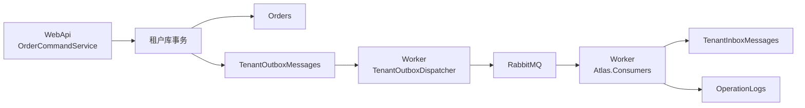

# Atlas 消息系统生产指南

本文档说明当前项目的消息系统设计、已修复的高风险问题，以及生产集成和运维方式。

## 当前结论

Atlas 当前采用 RabbitMQ + MassTransit 作为业务消息基础设施，不再使用 Redis Pub/Sub 承载可靠业务消息。

RabbitMQ 本身不依赖业务数据库。当前系统依赖数据库，是因为采用了 outbox/inbox 模式来保证可靠性：

- RabbitMQ 负责消息路由、队列、消费者分发、ack 和 error queue。
- 数据库 outbox 负责把“待发送消息”和业务数据放在同一个事务中提交，避免业务提交成功但消息丢失。
- 数据库 inbox 负责消费端幂等，避免 RabbitMQ 至少一次投递导致重复副作用。

消息系统分为两条路径：

1. Global 库事务事件：使用 MassTransit EF transactional outbox，适合租户开通这类 Global 数据库内的状态变化。
2. Tenant 库业务事件：使用租户库本地 outbox，适合订单、库存、收银等租户库业务数据变化。

核心原则是：业务数据和对应 outbox 记录必须在同一个数据库事务里提交。不能先提交业务数据，再另开一个库或另一个事务发布消息。

生产部署边界：

- WebApi 使用 `Atlas:Runtime:Mode=WebApi`，只处理 HTTP、业务事务和 outbox 写入，不注册 RabbitMQ consumers，也不启动 tenant outbox dispatcher。
- RabbitMQ consumers 放在 `src/Atlas.Consumers`。
- Worker 使用 `Atlas:Runtime:Mode=Worker`，由 `src/Atlas.Worker` 承载 `TenantOutboxDispatcher`、MassTransit consumers 和后台任务 runner。
- WebApi 和 Worker 独立扩容、独立发布、独立排障。

## 已修复的 P0/P1 问题

### P0：订单提交和消息记录不在同一事务

之前 `OrderCommandService` 的流程是：

1. 提交租户库订单事务。
2. 再打开 Global 库事务，通过 MassTransit outbox 发布 `OrderPlacedEvent`。

如果第 1 步成功、第 2 步失败，就会出现订单已存在但消息永久丢失。这是典型 P0。

现在已改为：

1. 在租户库事务中写入 `Orders`。
2. 在同一个租户库事务中写入 `TenantOutboxMessages`。
3. 事务提交后，后台 `TenantOutboxDispatcher` 异步投递到 RabbitMQ。

### P1：消费者缺少幂等保护

RabbitMQ/MassTransit 默认是至少一次投递。消费者写数据库后，如果 ack 前进程崩溃，消息可能重投。

现在示例 `OrderPlacedEventConsumer` 会在同一个租户库事务中写入：

- `TenantInboxMessages`
- `OperationLogs`

`TenantInboxMessages` 对 `(MessageId, ConsumerName)` 建唯一索引，用来防止重复消费。

### P1：多租户 outbox dispatcher 不能只扫前 N 个租户

后台投递器不能每轮只处理固定前 N 个租户，否则租户数量超过批次上限时，后面的租户会长期饿死。

现在 `TenantOutboxDispatcher` 按租户 ID 分页处理所有 active/trial 租户。

## 架构



## 消息生命周期

以下用 `OrderPlacedEvent` 说明当前系统里一条消息从定义到消费的完整链路。

### 1. 定义消息

所有消息事件都实现 `IDomainEvent`。最小元数据包括消息 ID、事件名、发生时间和租户 ID。

```csharp
public interface IDomainEvent
{
    Guid EventId { get; }
    string EventName { get; }
    DateTimeOffset OccurredAt { get; }
    long? TenantId { get; }
}
```

下单事件定义：

```csharp
public sealed class OrderPlacedEvent : IDomainEvent
{
    public Guid EventId { get; init; } = Guid.NewGuid();
    public string EventName => "order.placed";
    public DateTimeOffset OccurredAt { get; init; } = DateTimeOffset.UtcNow;
    public long? TenantId { get; init; }
    public long StoreId { get; init; }
    public long OrderId { get; init; }
    public string OrderNo { get; init; } = string.Empty;
    public long MemberId { get; init; }
    public decimal TotalAmount { get; init; }
    public int ItemCount { get; init; }
}
```

`EventId` 是全链路关键字段：

- 发布到 RabbitMQ 时作为 `MessageId` 和 `CorrelationId`。
- 写入 `TenantOutboxMessages.EventId`，防止重复入队。
- 消费端写入 `TenantInboxMessages.MessageId`，防止重复消费。

### 2. 产生消息

业务服务在业务状态变化时创建事件。以下是下单场景的核心逻辑：

```csharp
var integrationEvent = new OrderPlacedEvent
{
    TenantId = tenantId,
    StoreId = storeId,
    OrderId = order.Id,
    OrderNo = order.OrderNo,
    MemberId = order.MemberId,
    TotalAmount = order.TotalAmount,
    ItemCount = request.ItemCount
};
```

租户库业务事件不能直接 publish 到 RabbitMQ，也不能写 Global outbox。它必须写入当前租户库的 `TenantOutboxMessages`。

### 3. 同事务写业务数据和 outbox

订单和消息记录在同一个租户库事务提交：

```csharp
await _tenantUnitOfWork.BeginTransactionAsync(ct);
try
{
    await _orders.AddAsync(order, ct);
    await _tenantOutbox.EnqueueAsync(integrationEvent, ct);
    await _tenantUnitOfWork.SaveChangesAsync(ct);
    await _tenantUnitOfWork.CommitAsync(ct);
}
catch
{
    if (_tenantUnitOfWork.HasActiveTransaction)
        await _tenantUnitOfWork.RollbackAsync(ct);
    throw;
}
```

这个事务成功后，系统只承诺“消息已可靠入库并等待投递”，不承诺此时已经到达 RabbitMQ。接口返回里的 `EventQueued = true` 表示已写入 outbox；`EventPublished = false` 表示还未确认投递到 broker。

### 4. 后台投递到 RabbitMQ

`TenantOutboxDispatcher` 周期性扫描 active/trial 租户，然后读取每个租户库的待投递消息。

待投递条件：

```csharp
x.ProcessedAtUtc == null &&
x.AttemptCount < maxAttempts &&
(x.AvailableAtUtc == null || x.AvailableAtUtc <= now) &&
(x.NextAttemptAtUtc == null || x.NextAttemptAtUtc <= now) &&
(x.ProcessingAtUtc == null || x.ProcessingAtUtc < staleProcessingBefore)
```

为了支持多实例部署，dispatcher 会先用 SQL 原子抢占消息：

```sql
UPDATE TenantOutboxMessages
SET ProcessingAtUtc = @now,
    ProcessingBy = @workerId,
    UpdatedAt = @now
WHERE Id = @messageId
  AND TenantId = @tenantId
  AND ProcessedAtUtc IS NULL
  AND AttemptCount < @maxAttempts
  AND (AvailableAtUtc IS NULL OR AvailableAtUtc <= @now)
  AND (NextAttemptAtUtc IS NULL OR NextAttemptAtUtc <= @now)
  AND (ProcessingAtUtc IS NULL OR ProcessingAtUtc < @staleProcessingBefore);
```

只有更新到 1 行的实例拥有投递权。投递成功后：

```csharp
message.ProcessedAtUtc = DateTime.UtcNow;
message.ProcessingAtUtc = null;
message.ProcessingBy = null;
message.LastError = null;
await db.SaveChangesAsync(ct);
```

### 5. 发布到 RabbitMQ

RabbitMQ transport 使用 MassTransit 的 `IBus.Publish`，并设置消息元数据：

```csharp
return _bus.Publish(
    (object)domainEvent,
    Pipe.Execute<PublishContext>(context =>
    {
        context.MessageId = domainEvent.EventId;
        context.CorrelationId = domainEvent.EventId;
        context.Headers.Set("Atlas-EventName", domainEvent.EventName);
        context.Headers.Set("Atlas-OccurredAt", domainEvent.OccurredAt);

        if (domainEvent.TenantId.HasValue)
            context.Headers.Set("Atlas-TenantId", domainEvent.TenantId.Value);
    }),
    ct);
```

### 6. 消费消息

消费者继承 `TenantConsumerBase<TEvent>`，基类统一处理 `TenantId` 校验、租户库事务、inbox 幂等和提交：

```csharp
public sealed class OrderPlacedEventConsumer : TenantConsumerBase<OrderPlacedEvent>
{
    private readonly IRepository<OperationLog> _operationLogs;

    public OrderPlacedEventConsumer(
        ITenantConsumerRuntime runtime,
        IRepository<OperationLog> operationLogs,
        ILogger<OrderPlacedEventConsumer> logger)
        : base(runtime)
    {
        _operationLogs = operationLogs;
    }

    protected override string ConsumerName => nameof(OrderPlacedEventConsumer);

    protected override async Task ConsumeTenantMessageAsync(
        ConsumeContext<OrderPlacedEvent> context,
        long tenantId,
        Guid messageId,
        CancellationToken ct)
    {
        // Use repositories or domain services here. The runtime writes inbox
        // and commits it in the same transaction as this work.
        var operationLog = new OperationLog
        {
            TenantId = tenantId,
            Module = "Order",
            OperationType = "Placed"
        };

        await _operationLogs.AddAsync(operationLog, tenantId, ct);
    }
}
```

这保证：

- 消费失败发生在事务提交前：inbox 和业务副作用都不会落库，消息可重试。
- 消费成功但 ack 前进程崩溃：RabbitMQ 会重投，consumer 看到 inbox 已存在后跳过。

## 核心组件

### IDomainEvent

所有业务事件都实现 `IDomainEvent`：

```csharp
public interface IDomainEvent
{
    Guid EventId { get; }
    string EventName { get; }
    DateTimeOffset OccurredAt { get; }
    long? TenantId { get; }
}
```

`EventId` 必须稳定且全局唯一，用作消息 ID、关联 ID 和幂等键。

### IDomainEventPublisher

用于 Global 库事务事件。RabbitMQ 模式下由 `MassTransitDomainEventPublisher` 实现，配合 `AtlasGlobalDbContext` 的 MassTransit EF outbox。

只在业务状态也写入 Global 数据库时使用。

### ITenantDomainEventOutbox

用于租户库业务事件。调用 `EnqueueAsync` 只写入当前租户库的 `TenantOutboxMessages`，不直接访问 RabbitMQ。

典型用法：

```csharp
await _tenantUnitOfWork.BeginTransactionAsync(ct);
try
{
    await _orders.AddAsync(order, ct);
    await _tenantOutbox.EnqueueAsync(orderPlacedEvent, ct);
    await _tenantUnitOfWork.SaveChangesAsync(ct);
    await _tenantUnitOfWork.CommitAsync(ct);
}
catch
{
    if (_tenantUnitOfWork.HasActiveTransaction)
        await _tenantUnitOfWork.RollbackAsync(ct);
    throw;
}
```

### TenantOutboxDispatcher

RabbitMQ 模式下注册的后台服务。生产环境建议只在 `Atlas.Worker` 中启用，WebApi 只写 outbox，不负责后台投递。它会：

1. 扫描 active/trial 租户。
2. 按租户库读取待投递 `TenantOutboxMessages`。
3. 使用原子 SQL claim 消息，避免多实例重复抢占。
4. 通过 `IDomainEventTransport` 投递到 RabbitMQ。
5. 成功后标记 `ProcessedAtUtc`；失败后按指数退避更新 `NextAttemptAtUtc`。

### TenantInboxMessages

消费者幂等表。每个消费者处理消息时，应在同一个业务写入事务中插入 inbox 记录。

唯一键：

```text
(MessageId, ConsumerName)
```

## 失败和重试

当前系统有两层重试：outbox 投递重试和 RabbitMQ 消费重试。

### Outbox 投递失败

如果 RabbitMQ 暂时不可用，或者网络/序列化/transport 发生异常，`TenantOutboxDispatcher` 不会删除 outbox 消息，而是记录失败并延后重试：

```csharp
message.AttemptCount++;
message.ProcessingAtUtc = null;
message.ProcessingBy = null;
message.LastError = Truncate(exception.ToString(), 2000);

if (message.AttemptCount < MaxAttempts)
{
    message.NextAttemptAtUtc = DateTime.UtcNow.Add(GetRetryDelay(message.AttemptCount));
}
```

重试延迟是指数退避：

```csharp
var seconds = Math.Min(
    MaxRetryDelaySeconds,
    InitialRetryDelaySeconds * Math.Pow(2, attemptCount - 1));
```

达到 `MaxAttempts` 后，消息不会继续自动重试，但仍留在 `TenantOutboxMessages` 中，便于排查和人工补偿。

### 消费失败

消费者抛异常时，MassTransit 会按 RabbitMQ 配置做 immediate retry：

```csharp
cfg.UseMessageRetry(retry =>
    retry.Interval(
        options.RetryLimit,
        TimeSpan.FromSeconds(options.RetryIntervalSeconds)));
```

当前示例配置：

```json
{
  "RabbitMQ": {
    "RetryLimit": 5,
    "RetryIntervalSeconds": 5
  }
}
```

如果重试耗尽，MassTransit 会把消息移动到 consumer 对应的 error queue，通常命名为：

```text
{consumer-queue-name}_error
```

这类消息不会静默丢失，但也不会无限重试。生产环境需要对 error queue 做告警，并提供人工 requeue 或补偿流程。

### 失败场景行为

| 场景 | 当前行为 | 是否丢消息 |
| --- | --- | --- |
| 订单事务提交前失败 | 订单和 outbox 都回滚 | 不产生消息 |
| 订单提交后应用崩溃 | outbox 已落库，dispatcher 恢复后继续投递 | 不丢 |
| RabbitMQ 不可用 | outbox 记录失败和下次重试时间 | 不丢 |
| dispatcher 多实例同时扫描 | 原子 SQL claim，只有一个实例投递 | 不重复投递为目标，但仍按至少一次设计 |
| 消费者业务处理失败 | MassTransit retry，耗尽后进 error queue | 不静默丢 |
| 消费成功但 ack 前崩溃 | RabbitMQ 重投，inbox 幂等跳过重复副作用 | 不重复执行业务副作用 |

## 数据库迁移

Global 库需要 MassTransit outbox 表：

```text
InboxState
OutboxMessage
OutboxState
```

租户库新增：

```text
TenantOutboxMessages
TenantInboxMessages
```

本次新增迁移：

```text
src/Atlas.Data.Tenant.Migrations/Migrations/20260516092858_v0.1.2-add-tenant-messaging-state.cs
```

生产启用 RabbitMQ 前，必须对所有租户库应用最新 tenant migration。否则 dispatcher 启动后会因为缺表持续失败。

## 数据库表

### Global 库：MassTransit outbox 表

Global 库由 MassTransit EF outbox 管理，表结构来自 MassTransit。

| 表名 | 用途 |
| --- | --- |
| `OutboxMessage` | 保存待投递或已投递的 MassTransit 消息。 |
| `OutboxState` | 保存 outbox 投递进度和并发状态。 |
| `InboxState` | MassTransit inbox 状态表，用于 MassTransit 自身的 inbox/outbox 协调。 |

Global 库适用场景：业务数据也写在 `AtlasGlobalDbContext` 中，例如租户开通状态变化和 `TenantProvisionedEvent`。

### TenantOutboxMessages

租户库 outbox 表。业务数据和该表必须在同一租户库事务中提交。

| 字段 | 类型语义 | 说明 |
| --- | --- | --- |
| `Id` | bigint | 雪花 ID，主键。 |
| `TenantId` | bigint | 租户 ID。 |
| `StoreId` | bigint nullable | 门店 ID，可选。 |
| `EventId` | guid | 业务事件 ID，唯一索引。 |
| `EventName` | string | 事件名，例如 `order.placed`。 |
| `MessageType` | string | .NET 事件类型，用于反序列化。 |
| `Payload` | longtext | 事件 JSON 内容。 |
| `OccurredAtUtc` | datetime | 业务事件发生时间。 |
| `AvailableAtUtc` | datetime nullable | 最早可投递时间。 |
| `ProcessingAtUtc` | datetime nullable | 当前被某个 dispatcher 抢占处理的时间。 |
| `ProcessingBy` | string nullable | 抢占该消息的 worker 标识。 |
| `ProcessedAtUtc` | datetime nullable | 投递成功时间。为空表示尚未投递成功。 |
| `AttemptCount` | int | 投递失败次数。 |
| `NextAttemptAtUtc` | datetime nullable | 下次重试时间。 |
| `LastError` | string nullable | 最近一次投递失败原因。 |
| `CreatedAt` | datetime | 入库时间。 |
| `UpdatedAt` | datetime nullable | 最近更新时间。 |

关键索引：

| 索引 | 说明 |
| --- | --- |
| `UX_TenantOutboxMessages_Tenant_EventId` | 防止同一租户内同一事件重复入 outbox。 |
| `IX_TenantOutboxMessages_Tenant_ProcessDue` | dispatcher 按租户扫描待处理消息。 |
| `IX_TenantOutboxMessages_Processing` | 查找长时间 processing 或可抢占消息。 |

典型查询：

```sql
select Id, EventId, EventName, AttemptCount, NextAttemptAtUtc, LastError
from TenantOutboxMessages
where ProcessedAtUtc is null
  and TenantId = @tenantId
order by CreatedAt
limit 50;
```

### TenantInboxMessages

租户库 inbox 表。消费者用它做幂等控制。

| 字段 | 类型语义 | 说明 |
| --- | --- | --- |
| `Id` | bigint | 雪花 ID，主键。 |
| `TenantId` | bigint | 租户 ID。 |
| `MessageId` | guid | RabbitMQ/MassTransit message id；默认等于业务事件 `EventId`。 |
| `ConsumerName` | string | 消费者名称。 |
| `ReceivedAtUtc` | datetime | 消费成功并落库的时间。 |
| `CreatedAt` | datetime | 入库时间。 |
| `UpdatedAt` | datetime nullable | 最近更新时间。 |

关键索引：

| 索引 | 说明 |
| --- | --- |
| `UX_TenantInboxMessages_Message_Consumer` | `(MessageId, ConsumerName)` 唯一，保证同一消费者不重复处理同一消息。 |
| `IX_TenantInboxMessages_Tenant_ReceivedAt` | 便于按租户清理历史 inbox 记录。 |

典型查询：

```sql
select MessageId, ConsumerName, ReceivedAtUtc
from TenantInboxMessages
where TenantId = @tenantId
order by ReceivedAtUtc desc
limit 50;
```

### RabbitMQ error queue

RabbitMQ 的 error queue 不在业务数据库中。消费重试耗尽后，MassTransit 会把消息移入 broker 中的 error queue。

生产环境需要监控：

- error queue 消息数量
- error queue 最早消息年龄
- error queue 中的异常 header
- 手工 requeue 或补偿后的处理结果

## 配置

示例：

```json
{
  "Messaging": {
    "Provider": "RabbitMQ",
    "RabbitMQ": {
      "Host": "localhost",
      "Port": 5672,
      "VirtualHost": "/",
      "Username": "guest",
      "Password": "guest",
      "PrefetchCount": 16,
      "RetryLimit": 5,
      "RetryIntervalSeconds": 5
    },
    "TenantOutbox": {
      "Enabled": true,
      "PollIntervalSeconds": 5,
      "TenantBatchSize": 100,
      "MessageBatchSize": 50,
      "MaxAttempts": 10,
      "InitialRetryDelaySeconds": 10,
      "MaxRetryDelaySeconds": 300,
      "ProcessingTimeoutSeconds": 300
    }
  }
}
```

生产环境不要使用 RabbitMQ 默认 `guest/guest` 账号。应使用独立 vhost、独立用户、最小权限和强密码。

## 新增业务事件接入方式

### 1. 定义事件

```csharp
public sealed class InventoryChangedEvent : IDomainEvent
{
    public Guid EventId { get; init; } = Guid.NewGuid();
    public string EventName => "inventory.changed";
    public DateTimeOffset OccurredAt { get; init; } = DateTimeOffset.UtcNow;
    public long? TenantId { get; init; }
    public long StoreId { get; init; }
    public long ProductId { get; init; }
    public int Quantity { get; init; }
}
```

### 2. 在租户库事务中写入 outbox

租户库业务事件不要直接调用 `IDomainEventPublisher`。应调用 `ITenantDomainEventOutbox.EnqueueAsync`。

完整模式：

```csharp
public async Task ChangeInventoryAsync(ChangeInventoryRequest request, CancellationToken ct)
{
    var domainEvent = new InventoryChangedEvent
    {
        TenantId = tenantId,
        StoreId = storeId,
        ProductId = request.ProductId,
        Quantity = request.Quantity
    };

    await _tenantUnitOfWork.BeginTransactionAsync(ct);
    try
    {
        inventory.Quantity = request.Quantity;
        await _tenantOutbox.EnqueueAsync(domainEvent, ct);
        await _tenantUnitOfWork.SaveChangesAsync(ct);
        await _tenantUnitOfWork.CommitAsync(ct);
    }
    catch
    {
        if (_tenantUnitOfWork.HasActiveTransaction)
            await _tenantUnitOfWork.RollbackAsync(ct);
        throw;
    }
}
```

### 3. 编写消费者

消费者必须按 `TenantId + MessageId + ConsumerName` 做幂等。可以参考：

```text
src/Atlas.Consumers/Orders/OrderPlacedEventConsumer.cs
```

推荐模板：

```csharp
public sealed class InventoryChangedEventConsumer : TenantConsumerBase<InventoryChangedEvent>
{
    public InventoryChangedEventConsumer(
        ITenantConsumerRuntime runtime,
        ILogger<InventoryChangedEventConsumer> logger)
        : base(runtime)
    {
    }

    protected override string ConsumerName => nameof(InventoryChangedEventConsumer);

    protected override Task ConsumeTenantMessageAsync(
        ConsumeContext<InventoryChangedEvent> context,
        long tenantId,
        Guid messageId,
        CancellationToken ct)
    {
        // Use repositories or domain services here.
        return Task.CompletedTask;
    }
}
```

## 语义和边界

- 当前系统提供至少一次投递，不提供 exactly-once。
- outbox 解决“业务提交成功但消息丢失”的问题。
- inbox 解决“消息重复投递导致业务副作用重复执行”的问题。
- 消费者逻辑必须天然可重试，不能依赖只执行一次。
- 不要在租户业务写路径中直接 publish 到 RabbitMQ。
- 不要把租户库业务事件写入 Global outbox，这无法和租户库业务事务原子提交。
- 不要把生产 RabbitMQ consumers 放在 WebApi 层；WebApi 扩容不能隐式改变消费吞吐。
- WebApi 建议设置 `Messaging:TenantOutbox:Enabled=false`；Worker 设置为 `true`。

## 运维监控

每个租户库建议监控待投递消息：

```sql
select count(*)
from TenantOutboxMessages
where TenantId = @tenantId
  and ProcessedAtUtc is null;
```

监控死信式失败消息：

```sql
select EventId, EventName, AttemptCount, LastError, CreatedAt, NextAttemptAtUtc
from TenantOutboxMessages
where ProcessedAtUtc is null
  and TenantId = @tenantId
  and AttemptCount >= 10
order by CreatedAt
limit 50;
```

监控长时间 processing 的消息：

```sql
select EventId, EventName, ProcessingAtUtc, ProcessingBy
from TenantOutboxMessages
where ProcessedAtUtc is null
  and TenantId = @tenantId
  and ProcessingAtUtc is not null
  and ProcessingAtUtc < utc_timestamp() - interval 10 minute;
```

## 生产检查清单

1. 所有租户库已应用 tenant migration。
2. Global 库已应用 MassTransit outbox migration。
3. `Messaging:Provider` 设置为 `RabbitMQ`。
4. RabbitMQ 使用生产 vhost、独立账号和强密码。
5. 每个消费者都有 inbox 幂等保护。
6. 每个业务写路径只在同库事务内写 outbox。
7. 已监控 `TenantOutboxMessages` 的积压、失败和长时间 processing。
8. WebApi 未注册 consumer assembly，消费者由 Worker 注册 `Atlas.Consumers`。
