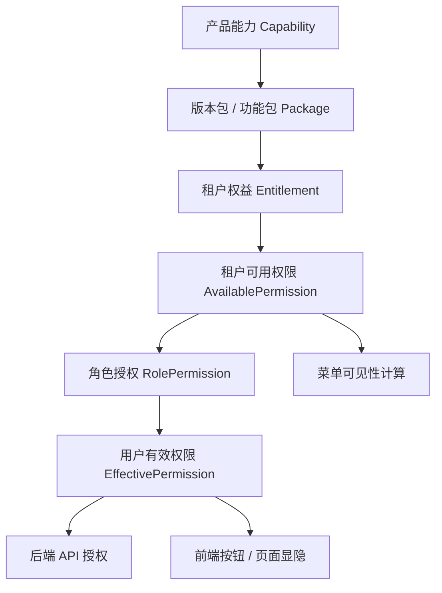
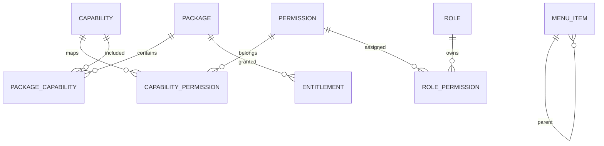

# 权限、菜单、功能包理想设计方案

## 1. 设计目标

本文档面向 SaaS / 多租户 / 多版本产品，目标是提供一套可复用的权限、菜单、功能包设计方案。

核心目标：

- 功能开通、用户授权、菜单展示三者解耦。
- 支持版本包、增值包、试用包、灰度功能、租户/门店差异。
- 支持角色权限、数据权限、操作权限、菜单权限。
- 后端 API 始终作为安全边界，前端只做体验层显隐。
- 支持权限诊断，能解释“为什么某用户有/没有某能力”。
- 支持缓存和配置变更后的可靠失效。

非目标：

- 不把菜单系统当作权限系统。
- 不把功能包开通状态直接当作用户操作权限。
- 不依赖前端隐藏按钮保证安全。

## 2. 核心原则

### 2.1 三层分离

权限体系应拆成三层：

- 产品能力层：定义系统有哪些能力，例如收费、病历、AI、报表、导出。
- 租户权益层：定义租户/门店购买或开通了哪些能力。
- 用户授权层：定义某个用户在已开通能力范围内能做什么。

菜单展示是第四层消费方，不参与最终授权判断。



### 2.2 后端授权优先

所有敏感操作必须在后端校验权限。前端的菜单、路由、按钮控制只用于减少误操作和改善体验。

### 2.3 能力开通不等于用户授权

租户开通了 `aiDiagnosis`，只表示这个租户可以使用 AI 诊断能力。具体用户是否能创建 AI 诊断任务，应由真实权限点控制，例如 `aiDiagnosis.task.create`。

### 2.4 可解释性优先

权限系统必须能回答：

- 租户是否购买了该能力？
- 当前门店是否继承或开通了该能力？
- 该能力映射了哪些权限点？
- 用户角色是否允许该权限点？
- 是否被数据权限、门店选项、灰度规则或有效期拦截？

## 3. 概念模型

### 3.1 Capability

产品能力，表示系统可售卖、可授权、可灰度的能力单元。

示例：

- `patient`
- `charge`
- `emr`
- `report.finance`
- `ai.diagnosis`
- `message.sms`

建议字段：

| 字段 | 说明 |
| --- | --- |
| `code` | 能力编码 |
| `name` | 展示名称 |
| `category` | 能力分类 |
| `status` | active / disabled |
| `description` | 说明 |

### 3.2 Package

功能包或版本包，是能力的售卖/开通集合。

Package 类型建议：

- `edition`：版本包，例如 Free、Standard、Enterprise。
- `addon`：增值包，例如 AI 诊断、短信、BI 高级版。
- `trial`：试用包。
- `internal`：内部白名单包。

建议字段：

| 字段 | 说明 |
| --- | --- |
| `code` | 包编码 |
| `name` | 包名称 |
| `type` | edition / addon / trial / internal |
| `status` | active / disabled |
| `description` | 说明 |

### 3.3 PackageCapability

Package 与 Capability 的映射。

一个包可以包含多个能力，一个能力也可以被多个包包含。

| 字段 | 说明 |
| --- | --- |
| `packageCode` | 包编码 |
| `capabilityCode` | 能力编码 |
| `limitJson` | 能力限制，例如次数、容量、人数 |
| `optionJson` | 默认配置 |

### 3.4 Permission

权限点，表示用户可执行的具体动作。

权限点应围绕操作建模，不应围绕菜单建模。

命名建议：

- `domain.resource.action`
- 示例：`patient.record.view`
- 示例：`patient.record.create`
- 示例：`charge.order.refund`
- 示例：`report.finance.export`
- 示例：`ai.diagnosis.task.create`

建议字段：

| 字段 | 说明 |
| --- | --- |
| `code` | 权限编码 |
| `name` | 权限名称 |
| `capabilityCode` | 归属能力 |
| `resource` | 资源 |
| `action` | 操作 |
| `isAssignable` | 是否允许角色配置 |
| `isSystem` | 是否系统内部权限 |
| `riskLevel` | low / medium / high |

### 3.5 CapabilityPermission

Capability 与 Permission 的映射。

租户开通某能力后，才可能拥有该能力下的权限点。但用户最终是否拥有权限，还要看角色授权。

### 3.6 Entitlement

租户/组织/门店权益，表示某对象开通了哪个 Package 或 Capability。

建议支持多级主体：

- tenant
- group
- office
- department

建议字段：

| 字段 | 说明 |
| --- | --- |
| `subjectType` | tenant / group / office |
| `subjectId` | 主体 ID |
| `packageCode` | 开通的包 |
| `source` | order / manual / trial / inherited |
| `startAt` | 生效时间 |
| `endAt` | 失效时间 |
| `status` | active / paused / cancelled |
| `optionOverrideJson` | 当前主体的包配置覆盖 |

### 3.7 RolePermission

角色权限，表示用户角色是否允许某权限点。

| 字段 | 说明 |
| --- | --- |
| `roleId` | 角色 ID |
| `permissionCode` | 权限编码 |
| `effect` | allow / deny |

建议保留 `deny`，便于默认角色和租户自定义角色做差异覆盖。

### 3.8 DataScope

数据权限，控制“能看哪些数据”，不应和功能权限混在一起。

示例：

- 全部数据
- 本门店数据
- 本部门数据
- 本人数据
- 指定组织树数据

### 3.9 MenuItem

菜单项只负责导航展示，不负责最终授权。

建议字段：

| 字段 | 说明 |
| --- | --- |
| `code` | 菜单编码 |
| `name` | 菜单名称 |
| `route` | 前端路由 |
| `parentCode` | 父菜单 |
| `visibleWhen` | 可见条件表达式 |
| `sortOrder` | 排序 |
| `icon` | 图标 |
| `status` | active / disabled |

`visibleWhen` 可以引用 capability、permission、feature flag，但不能替代 API 授权。

## 4. 推荐数据关系



最小表集合：

- `capability`
- `permission`
- `capability_permission`
- `package`
- `package_capability`
- `entitlement`
- `role`
- `role_permission`
- `user_role`
- `data_scope`
- `menu_item`

## 5. 权限计算流程

### 5.1 租户可用能力

输入：

- tenantId
- officeId
- 当前时间

流程：

1. 查询 tenant / group / office 有效 Entitlement。
2. 展开 Package 到 Capability。
3. 合并继承能力、版本包能力、addon 能力。
4. 应用有效期、状态、灰度、区域、组织类型限制。
5. 输出 `AvailableCapabilitySet`。

### 5.2 租户可用权限

输入：

- `AvailableCapabilitySet`

流程：

1. 根据 `CapabilityPermission` 展开权限点。
2. 过滤 disabled / system-only / 不适用组织类型权限。
3. 输出 `AvailablePermissionSet`。

### 5.3 用户有效权限

输入：

- userId
- officeId
- `AvailablePermissionSet`

流程：

1. 查询用户角色。
2. 合并角色 allow / deny 权限。
3. 与 `AvailablePermissionSet` 取交集。
4. 叠加系统管理员规则。
5. 输出 `EffectivePermissionSet`。

伪代码：

```typescript
function calculateEffectivePermissions(user, context) {
  const capabilities = entitlementService.getAvailableCapabilities(context);
  const availablePermissions = permissionCatalog.expandByCapabilities(capabilities);

  if (user.isTenantAdmin) {
    return availablePermissions;
  }

  const rolePermissions = roleService.getMergedRolePermissions(user.roleIds);
  const allowed = rolePermissions.allow.minus(rolePermissions.deny);

  return allowed.intersect(availablePermissions);
}
```

## 6. 授权表达式规范

不要在前端或后端散落字符串解析逻辑。建议定义统一表达式语法，并由共享 parser 解析。

支持：

- `permission("patient.record.view")`
- `capability("ai.diagnosis")`
- `featureFlag("newDashboard")`
- `all(...)`
- `any(...)`
- `not(...)`

示例：

```json
{
  "any": [
    { "permission": "patient.record.view" },
    {
      "all": [
        { "capability": "patient" },
        { "permission": "patient.record.viewOwn" }
      ]
    }
  ]
}
```

不推荐：

```text
patient.record.view|patient.record.viewOwn&package.ai
```

原因：

- 可读性差。
- 优先级不明确。
- 容易被特殊字符破坏。
- 难以做静态校验。

## 7. 后端 API 授权设计

### 7.1 注解式授权

推荐为 API 提供明确注解：

```csharp
[RequirePermission("charge.order.refund")]
public RefundResult RefundOrder(RefundInput input)
{
    ...
}
```

复杂场景：

```csharp
[RequirePolicy("CanExportFinanceReport")]
public FileResult ExportFinanceReport(Query input)
{
    ...
}
```

### 7.2 Policy

Policy 用于组合权限、能力、数据范围和业务条件。

示例：

```csharp
public class CanExportFinanceReportPolicy : IAuthorizationPolicy
{
    public bool Evaluate(UserContext user, RequestContext request)
    {
        return user.HasPermission("report.finance.export")
            && user.HasCapability("report.finance")
            && user.DataScope.CanAccessOffice(request.OfficeId);
    }
}
```

### 7.3 API 授权返回

无权限统一返回：

- HTTP 403。
- 错误码：`PERMISSION_DENIED`。
- 诊断 ID：`authorizationTraceId`。

示例：

```json
{
  "code": "PERMISSION_DENIED",
  "message": "当前用户无权执行该操作",
  "authorizationTraceId": "authz_20260601_000001"
}
```

## 8. 前端设计

### 8.1 权限上下文

前端登录后只拿必要上下文：

```typescript
interface AuthorizationContext {
  permissions: string[];
  capabilities: string[];
  featureFlags: string[];
  dataScope: DataScope;
}
```

注意：

- `capabilities` 用于判断租户是否开通能力。
- `permissions` 用于判断用户是否可操作。
- 两者不要混用。

### 8.2 路由守卫

路由可以配置权限或能力条件：

```typescript
{
  path: 'finance/report',
  component: FinanceReportPage,
  data: {
    auth: {
      all: [
        { capability: 'report.finance' },
        { permission: 'report.finance.view' }
      ]
    }
  }
}
```

### 8.3 指令

按钮、链接、危险操作入口使用权限指令：

```html
<button authIf='{"permission":"charge.order.refund"}'>
  退款
</button>
```

### 8.4 菜单展示

菜单由配置生成，但只作为展示入口：

```json
{
  "code": "finance.report",
  "name": "财务报表",
  "route": "/finance/report",
  "visibleWhen": {
    "all": [
      { "capability": "report.finance" },
      { "permission": "report.finance.view" }
    ]
  }
}
```

菜单可见不代表 API 可访问。API 必须再次授权。

## 9. 功能包设计

### 9.1 版本包与增值包

版本包用于定义基础能力集合：

- Free
- Standard
- Professional
- Enterprise

增值包用于定义额外能力：

- AI 诊断
- 高级报表
- 短信包
- 多门店管理

不要让版本包直接映射用户权限。推荐链路：

```text
Package -> Capability -> Permission
```

这样可以做到：

- 包调整时不直接影响权限命名。
- 一个能力可以被多个包复用。
- 权限点可以稳定演进。

### 9.2 能力限制

功能包可能包含额度或限制：

```json
{
  "capabilityCode": "ai.diagnosis",
  "limits": {
    "monthlyTaskCount": 1000,
    "maxConcurrentTask": 5
  }
}
```

限制不应编码进权限码。例如不要设计：

```text
ai.diagnosis.monthly1000
```

应设计为：

- capability：`ai.diagnosis`
- permission：`ai.diagnosis.task.create`
- limit：`monthlyTaskCount = 1000`

### 9.3 包内配置

功能包默认配置放在 `package_capability.optionJson` 或 `package_option` 中。

租户/门店覆盖放在 `entitlement.optionOverrideJson`。

读取顺序：

1. 系统默认值。
2. Package 默认值。
3. 租户覆盖值。
4. 门店覆盖值。

## 10. 缓存设计

建议缓存四类结果：

- `AvailableCapabilitySet:{tenantId}:{officeId}`
- `AvailablePermissionSet:{tenantId}:{officeId}`
- `EffectivePermissionSet:{tenantId}:{officeId}:{userId}`
- `MenuTree:{tenantId}:{officeId}:{userId}:{locale}`

变更失效规则：

| 变更对象 | 需要失效 |
| --- | --- |
| Package / PackageCapability | 全局 package catalog，相关租户 capability / permission |
| Entitlement | 当前主体及下级主体 capability / permission / user permission |
| Permission | permission catalog，所有可用权限缓存 |
| RolePermission | 相关用户 EffectivePermissionSet |
| UserRole | 当前用户 EffectivePermissionSet |
| MenuItem | MenuTree |

建议使用事件驱动失效：

```text
EntitlementChanged
RolePermissionChanged
PermissionCatalogChanged
MenuConfigChanged
```

## 11. 权限诊断

必须提供诊断接口或后台工具。

输入：

```json
{
  "tenantId": 1001,
  "officeId": 2001,
  "userId": 3001,
  "permissionCode": "report.finance.export"
}
```

输出：

```json
{
  "permissionCode": "report.finance.export",
  "result": "denied",
  "steps": [
    {
      "stage": "capability",
      "result": "allowed",
      "reason": "office has package report.pro"
    },
    {
      "stage": "availablePermission",
      "result": "allowed",
      "reason": "capability report.finance maps to permission report.finance.export"
    },
    {
      "stage": "rolePermission",
      "result": "denied",
      "reason": "none of user roles grants report.finance.export"
    }
  ]
}
```

这类工具能显著降低客服、实施、开发排查成本。

## 12. 管理后台设计

建议拆成四类后台页面：

- 产品能力管理：维护 Capability、Permission、Package。
- 租户权益管理：给租户/门店开通版本包和增值包。
- 角色权限管理：给角色配置权限点。
- 权限诊断工具：按用户、门店、权限点解释授权结果。

角色权限页展示建议：

- 按 Capability 分组。
- 每个权限点显示风险等级。
- 高风险权限需要二次确认或审批。
- 不展示系统内部权限。

## 13. 测试策略

### 13.1 单元测试

覆盖：

- Package 展开 Capability。
- Capability 展开 Permission。
- Role allow / deny 合并。
- 管理员权限。
- 有效期、失效、取消订阅。
- 数据权限裁剪。

### 13.2 集成测试

覆盖：

- API 无权限返回 403。
- 菜单隐藏但 API 仍校验。
- 权限变更后缓存失效。
- Entitlement 变更后用户权限更新。

### 13.3 配置校验

发布前校验：

- Package 引用的 Capability 必须存在。
- Capability 引用的 Permission 必须存在。
- 菜单 `visibleWhen` 引用的权限/能力必须存在。
- 权限编码唯一。
- 高风险 API 必须配置后端授权。

## 14. 迁移建议

如果现有系统已经把 `package.*` 混入权限列表，可以分阶段迁移：

1. 保持旧权限返回不变，新增 `capabilities` 字段。
2. 前端新代码使用 `capabilities` 判断功能开通，使用 `permissions` 判断用户操作。
3. 后端禁止新增 API 使用 `package.*` 授权。
4. 增加静态扫描，发现 `RequirePermission("package.")` 直接阻断。
5. 逐步替换旧前端中的 `package.*` 操作权限判断。
6. 最终将 `package.*` 从用户权限列表中移除或标记为 legacy。

## 15. 推荐落地顺序

优先级建议：

1. 先定义统一术语和编码规范。
2. 建立 `Capability -> Permission` 和 `Package -> Capability` 两段模型。
3. 实现后端授权中间件/注解。
4. 实现用户有效权限计算和缓存。
5. 实现前端统一 auth service、route guard、auth directive。
6. 实现菜单配置和菜单过滤。
7. 实现权限诊断。
8. 补齐管理后台和配置校验。

## 16. 设计红线

以下做法不建议在新项目中使用：

- 用菜单编码当权限编码。
- 用功能包编码当操作权限。
- 前端隐藏按钮后，后端 API 不校验。
- 每个业务页面自己解析权限表达式。
- 权限表达式使用 `eval`。
- 直接改数据库开通功能包但不清缓存。
- 权限点命名包含套餐、价格、额度。
- 一个权限点同时表达“可见菜单”和“可执行操作”。

## 17. 最小可用版本

如果项目初期不想一次性做太复杂，可以先落地最小版本：

- `permission`
- `role_permission`
- `user_role`
- `package`
- `package_permission`
- `entitlement`

但需要保留两个边界：

- `package` 只能表示租户权益。
- `permission` 才能表示用户操作授权。

等业务复杂后，再把 `package_permission` 拆成：

```text
package -> capability -> permission
```

## 18. 总结

理想设计的关键不是把权限模型做得更复杂，而是把概念边界做清楚：

- Package 回答“租户买了什么”。
- Capability 回答“系统开放了什么能力”。
- Permission 回答“用户能做什么操作”。
- DataScope 回答“用户能操作哪些数据”。
- MenuItem 回答“用户在哪里进入功能”。

只要这五类职责不混用，系统就能在多版本、多租户、多前端、多业务线下保持可维护性。
